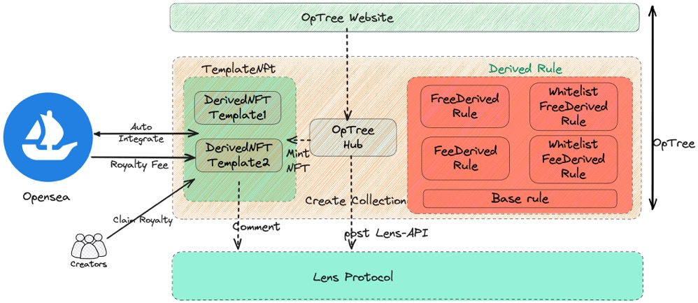

# OpTree

OpTree is a decentralized and permissionless co-created platform built on lens protocol🌿. Collection also can be built in a decentralized way, not always by artist or project.
Collaboration more powerful.

- Main Function
  - Any lens-handle holder can initial an collection(Photograph/novel/...) on OpTree.
  - Set conditions to limit participates(Free/Whitelist/Charge/Followers/...)
  - Participates pick one nft to fork, and show his creativity. All works form a collection.
  - This collection belongs to crowd.
  - Auto integrate Opensea after mint, All royalty fee from opensea goes into NFT smart contract. All creators withdraw from nft contracts according to their contribution.

## Setup

```bash
npm install hardhat --save-dev
npm install
npx hardhat compile
npx hardhat test
```

## Overview

OpTree build a decentralized co-creat platfrom. Anyone who hold lens handle can initial a empty collection on platform, in the deep, we invoke the post interface of lens protocol. Than you can upload #0 work to collection. Eligible participants can fork your work and make change. The organize seems like a reverse tree. The builder of collection provide root node, and others create leaf node. Like Github, Have many leafnode and branches.

- **architecture**

  

## Collection

Any address can inital a new collection on OpTree, it create a new ERC-721 NFT(ERC721URIStorage).
Collections are represented by a `DervideCollectionStruct`:

```
/**
 * @notice A struct represente a collection(ERC721URIStorage).
 *
 * @param creator The creator of this collection.
 * @param derivedNFTAddr The address of the derivedNFT associated with this collection.
 * @param derivedRuletModule The address of the current fork rule in use by this collection.
 * @param profileId The collection's associated lens handle.
 * @param pubId The pubId(post) to be displayed for the collection.
 */
struct DervideCollectionStruct {
  address creator;
  address derivedNFTAddr;
  address derivedRuletModule;
  uint256 profileId;
  uint256 pubId;
}
```

A new Post will be released when a new collection be initialized. Anyone who has lens handle can initial a collection.

## NFT Template

OpTree use ERC721(ERC721URIStorage) standard, each url of the nft can be defined as mint. So all nft of the collection can be created by crowd.

- example
  

## Rule (Fork rule)

We have referenced the design philosophy of Lens protocol and have created four rules for fork rule of OpTree.

- base rule: Every collection need set MintLimit & Finsh timestamp
- FreeDerivedRule: Anyone or just lens followers can free fork this nft of the collection
- FeeDerivedRule: Anyone or just lens followers can pay to fork this nft of the collection
- WhitelistFreeDerivedRule: whitelist or just whitelist in lens followers can free to fork this nft of the collection
- WhitelistFeeDerivedRule: whitelist or just whitelist in lens followers can pay to fork this nft of the collection

## Integrate Opensea

The Nft standard and royalty metadata follow the rule of opensea. so after the collection be crated on OpTree. this collection already be initialized on opensea. The owner of the nft can sale it on opensea.

## Integrate Lens Protocol(Lenster)

Cause all collection created & NFT minted will invoke post/comment interface of lens, So we can see a post in creator's lenster account. and all nft is the comments of this post.

## Fair royalty distribution mechanism

Cause the all nft of collection created by crowd. all of them are contributors. according to the rule of OpTree platform, The receipt address of royalty is the contract address of the nft. All contributors can claim royalty rewards from the nft contract based on their contribution.

## Quality of collection

To safeguard the quality of the collection and prevent individuals from maliciously damaging it, the rules allow the creator of the collection have right to delete an NFT within 7 days after minted(creator need to refund if this collection need charge.)
